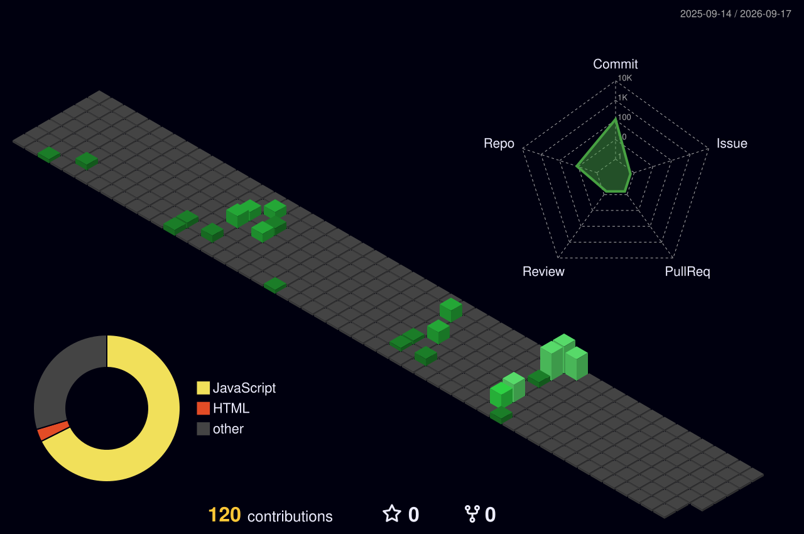

  

  

 

  
  &nbsp;
  
  &nbsp;&nbsp;
  

 

  

 

---

### 👋 About Me

[cite_start]I am a **3rd-year B.Tech Data Science student** at **SRM IST, Ghaziabad** [cite: 3, 5][cite_start], operating at the intersection of deep learning research and scalable full-stack software systems[cite: 12]. [cite_start]I specialize in translating advanced machine learning models into high-performance, production-ready applications[cite: 1, 13].

> [cite_start]**Core Focus:** Multimodal Deep Learning [cite: 74] [cite_start]• Agentic AI Systems [cite: 13, 21] [cite_start]• Full-Stack Engineering [cite: 12]  
> [cite_start]**Active Target:** Open to SDE & Machine Learning Internships [cite: 1]

- [cite_start]🧠 **Silent Signal** — Architecting a hybrid neural framework utilizing rPPG technology for real-time mental health diagnostics *(Selected for Microsoft Imagine Cup 2026)*[cite: 17, 21, 22, 52].
- [cite_start]🌐 **UHLIS** — Developing an agentic, distributed medical health ecosystem built with the MERN stack and TensorFlow[cite: 8, 9, 10, 13].

 

---

<h2>🏅 &nbsp;Career Highlights</h2>

<table>
  <tr>
    <td align="center" width="25%">
       
      [cite_start]<b>🏆 Selected Competitor</b> Silent Signal AI [cite: 17, 52]
    </td>
    <td align="center" width="25%">
       
      <b>🚀 Top 15 Global Finalist</b> Farm Navigators [cite: 33, 56]
    </td>
    <td align="center" width="25%">
       
      <b>📦 Top Percentile</b> Multimodal Deep Learning [cite: 74]
    </td>
    <td align="center" width="25%">
       
      <b>📝 Peer Reviewed</b> ML Predictive Analytics [cite: 43]
    </td>
  </tr>
</table>

 

---

<h2>🛠️ &nbsp;Tech Stack</h2>

**AI / Machine Learning**

 

**Full-Stack & Web**

 

**Cloud, DevOps & Tools**

 

**Languages**

 

---

<h2>🚀 &nbsp;Featured Projects</h2>

<table>
<tr>
<td width="50%" valign="top">

### 🧠 Silent Signal AI
> [cite_start]*Microsoft Imagine Cup 2026 — Selected Competitor [cite: 17, 52]*

[cite_start]Real-time mental health monitoring using **rPPG** (remote photoplethysmography) and a Hybrid Neural Architecture[cite: 21, 22]. [cite_start]Detects physiological stress signals through a standard webcam — no wearables needed[cite: 22].

</td>
<td width="50%" valign="top">

### 🛰️ NASA Farm Navigators
> [cite_start]*NASA Space Apps 2025 — Top 15 Global Finalist [cite: 33, 56]*

[cite_start]Geospatial dashboard processing **NASA satellite imagery** for climate-smart precision farming[cite: 36, 37]. [cite_start]Delivers crop yield forecasts, drought alerts, and soil health insights to farmers using real-time satellite data[cite: 36, 37].

</td>
</tr>
<tr>
<td width="50%" valign="top">

### 👁️ SleepLens
> [cite_start]*Clinical-grade Sleep Apnea Detection [cite: 26]*

[cite_start]Analyzes raw ECG signals using an XGBoost + Deep Learning ensemble to detect sleep apnea events with clinical-grade sensitivity[cite: 26, 29, 30]. [cite_start]Processes multi-channel physiological data to produce actionable sleep health reports[cite: 29, 31].

</td>
<td width="50%" valign="top">

### [cite_start]🌐 UHLIS [cite: 8]
> *Universal Health & Lifestyle Intelligence System*

[cite_start]Agentic AI workflows for predictive disease analysis across patient cohorts[cite: 13]. [cite_start]Combines MERN stack with Python ML models to deliver personalized health intelligence at scale[cite: 9, 10, 13].

</td>
</tr>
<tr>
<td width="50%" valign="top">

### ⚡ DevLeap AI
> *AI-Powered Competitive Programming Platform*

Intelligent competitive programming + automated interview prep with an AI hint system, complexity analyzer, and personalized weak-spot targeting. Generates custom problem sets based on performance history.

</td>
<td width="50%" valign="top">

### 📦 Revbase
> *Distributed Version Control System (Mini-Git)*

A lightweight, file-system-level version control platform built from the ground up — implementing branching, merging, commit graphs, and diffs with a full web UI. Think Git, but yours.

</td>
</tr>
</table>

 

---

<h2>📊 &nbsp;GitHub Analytics</h2>

 

  

 

---

<h2>🏆 &nbsp;GitHub Trophies</h2>

  

 

---

<h2>📈 &nbsp;Contribution Activity</h2>

  

 

---

<h2>🌐 &nbsp;3D Contribution Graph</h2>

 

---

<h2>🐍 &nbsp;Contribution Snake</h2>

  <picture>
    <source media="(prefers-color-scheme: dark)" srcset="https://raw.githubusercontent.com/Akj1002/Akj1002/output/github-snake-dark.svg" />
    <source media="(prefers-color-scheme: light)" srcset="https://raw.githubusercontent.com/Akj1002/Akj1002/output/github-snake.svg" />
    
  </picture>

 

---

<h2>🤝 &nbsp;Connect With Me</h2>

&nbsp;
&nbsp;

  

 

---

  

 

  ⭐️ If my work inspires you, consider giving a star — it means the world. Let's build something great together.

 

  

